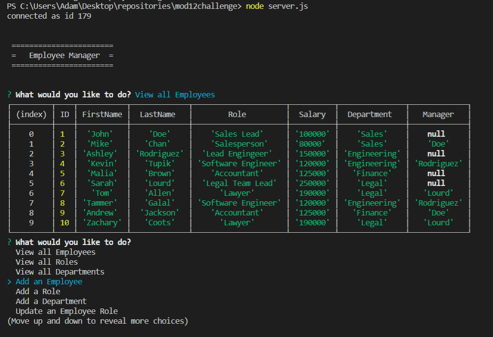

# mod12challenge
A command-line application to manage a company's employee database, using Node.js, Inquirer, and MySQL.

## Description: 
This application is an Employee Manager. A person can use it to keep track of their employees (roles, salaries, and their managers), a list of all the current jobs, and a list of all current departments. After starting the app, the user can select the tasks they would like to complete. Other than viewing the information mentioned above, the user can also add new employees, roles, and departments. The user can also update an employee to another role.

## Screenshot of Generated Webpage

## About the Project:
This program uses mySQL to create and seed the databases. After typing in the start up command, the program displays asynchronous Inquirer Prompts that can be selected to call the required functions. The "view" options are accomplished by making database calls using mySQL SELECT and JOIN statements. The add employee, role, and department functions use Inquirer prompts for the questions (some of which require mySQL queries) and send the data to the database to be stored in the proper manner. The final "update" feature uses the UPDATE command to find and select the proper employee to change their roles. 

## Link to Video Walkthrough
[Link to Assets Folder in Repository- Make sure to download the video!](https://github.com/adamkeyser45/mod12challenge/blob/master/assets/Employee_Manager_Video_Walkthrough.webm)
